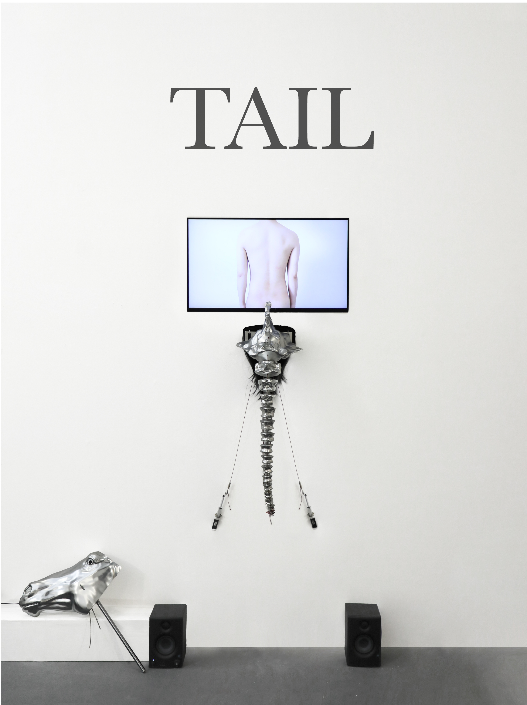

# TAIL



video link：https://youtu.be/1DqyYlydZfU

TAIL is a critical media art project that explores the power dynamics between technological systems and human subjectivity. The project consists of two parts: a live performance with a wearable device and an interactive physical installation.

The research motivation of this project is to ask: in a system that pursues extreme efficiency, how are humans gradually marginalized and ultimately abandoned? By constructing a spatial narrative from "physical discipline" to "machine takeover," the work visually presents this process of deprivation. When algorithms make decisions for humans in advance to eliminate latency, human-specific hesitation, thinking, and reaction time are defined by the system as inefficient defects that must be eradicated. Ultimately, this system, in its pursuit of absolute efficiency, not only replaces human physical labor but also directly eliminates the free will upon which humanity relies.

## 1. Hardware Components Required

Computer (Mac), webcam, Arduino UNO, L298N motor driver module, 12V telescoping motors (linear actuators), 12V motor power supply, USB data cable, jumper wires, speakers, monitor/display.

## 2. Software to Install

### 2.1 Python and its dependencies
First make sure Python 3 is installed (macOS usually ships with `python3`). Then install the dependencies in a terminal:

```bash
pip3 install opencv-python pyserial sounddevice numpy
```

- `opencv-python`: camera capture, face detection, video playback
- `pyserial`: controls the motors over the serial port (if missing, the program still runs but will not control the motors)
- `sounddevice` + `numpy`: real-time sound synthesis and audio output (if missing, the program still runs but produces no sound)

### 2.2 Arduino IDE
Download and install the Arduino IDE from the official website.

## 3. Wiring

### Control lines (Arduino -> L298N)
- Motor A (right): Arduino pin 4 -> L298N IN1, pin 5 -> IN2
- Motor B (left): Arduino pin 6 -> L298N IN3, pin 7 -> IN4

### Motor outputs (L298N -> motors)
- Motor A -> OUT1 / OUT2
- Motor B -> OUT3 / OUT4

### Power and ground 
- Connect the L298N motor-power input to the 12V supply positive terminal; connect the supply negative terminal to the L298N GND.
- The L298N GND must be tied together with the Arduino GND.
- Both the ENA and ENB enable jumpers on the L298N must be kept in place.

## 4. Flashing the Arduino

1. Connect the Arduino to the computer with a USB cable.
2. Open the Arduino IDE and open `Arduino.ino`.
3. Select your actual board model.
4. Click Upload and wait for "Done uploading".

## 5. Running the Program

Run `final.py` to start.

## 6. AI Usage Declaration

I hereby declare that the conceptual framework, theoretical research, and all visual and hardware designs for the TAIL project were conceived and completed entirely independently by me.

During the technical implementation phase, I utilized Artificial Intelligence tools as supplementary coding assistants. Specifically, AI was employed to help construct the Exponential Moving Average (EMA) algorithm within the Python script. This assistance was crucial in accurately calculating the velocity vectors of the audience's movements and successfully implementing the directional positioning for the predictive points.

Furthermore, I consulted AI tools as a debugging resource to help resolve two highly complex technical issues during system integration:

Implementing the non-blocking real-time audio synthesis callback using numpy and sounddevice, ensuring the dynamic overtone and distortion generation did not freeze the main computer vision loop.

Designing the control logic to strictly prevent the two telescoping motors from operating simultaneously. AI assisted in structuring a robust state machine that ensures one motor must completely finish its entire movement sequence before the other can be activated, effectively preventing structural damage to the physical installation.

All AI-assisted code was thoroughly reviewed, tested, and adapted by me to ensure it strictly served the project's core critical and artistic vision.
